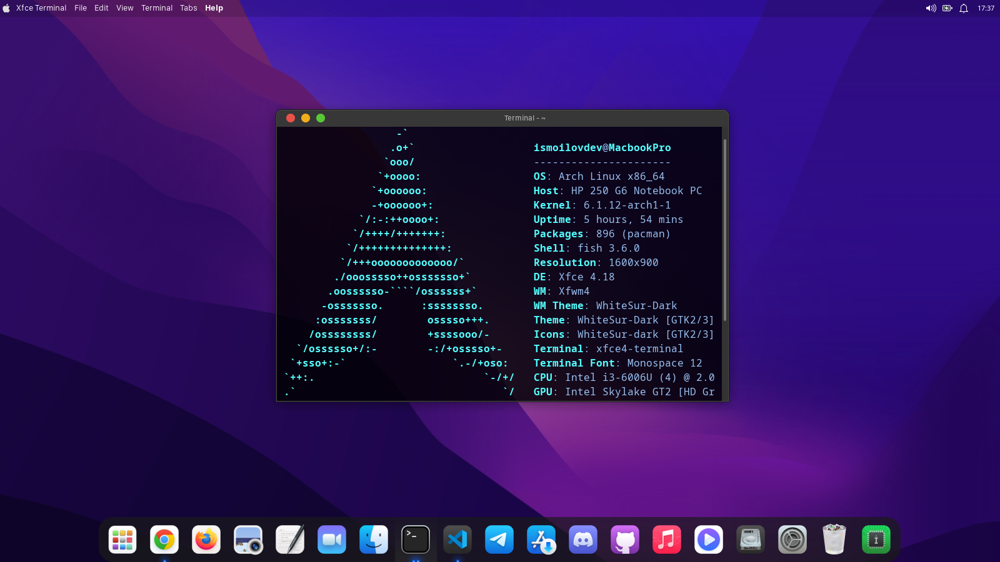

<h1 align="center">Arch Linux-ni o'rnatish bo'yicha bosqichma-bosqich qo'llanma</h1>

<p align="center"><a href="https://xinux.uz" target="_blank"></a></p>

## I. Kirish

Arch Linux — Linux kerneliga asoslangan bepul va Open Source operatsion tizim. Bu rolling release distributiv, ya'ni u doimiy ravishda yangilanadi va foydalanuvchilar eng so'nggi dasturiy ta'minot yangilanishlari va xavfsizlik tuzatishlarini oladi. Arch Linux o'zining soddaligi, moslashuvchanligi va minimalizmi bilan mashhur va o'z tizimini to'liq nazorat qilishni xohlaydigan foydalanuvchilarga mo'ljallangan.

Qo'llanmaning maqsadi: Ushbu qo'llanmaning maqsadi Arch Linuxni o'rnatish bo'yicha to'liq va bosqichma-bosqich qo'llanmani taqdim etishdir. Ushbu qo'llanma Arch Linux-ga yangi kelgan va uni sinab ko'rmoqchi bo'lgan yangi boshlanuvchilarga, shuningdek Arch Linux-ni o'z tizimlariga o'rnatmoqchi bo'lgan tajribali Linux foydalanuvchilariga yordam berish uchun mo'ljallangan.

Qo'llanma uchun maqsadli auditoriya: Ushbu qo'llanmaning maqsadli auditoriyasi tajriba darajasidan qat'i nazar, Arch Linuxni qanday o'rnatishni o'rganishga qiziqqan har bir kishidir. Qo'llanma Arch Linuxni o'z tizimlariga o'rnatishning oddiy va tushunarli usulini izlayotgan yangi boshlanuvchilar va tajribali Linux foydalanuvchilari uchun javob beradi.

> **Ogohlantirish:** o'rnatish jarayonida diskdagi barcha ma'lumotlar o'chib ketadi. Boshlashdan oldin muhim fayllaringizni zaxiralab (backup) oling.

## II. Tizim talablari

Minimal qurilma talablari: Arch Linux-ni muvaffaqiyatli o'rnatish uchun tizimingiz quyidagi minimal qurilma talablariga javob berishi kerak:

* 64 bitli (x86_64) protsessor
* Kamida 512 MB operativ xotira
* Kamida 2 GB bo'sh joyga ega xotira qurilmasi
* Faol internet aloqasi
* Kamida 2 GB hajmli USB drayver (o'rnatish uchun)

Tavsiya etilgan apparat spetsifikatsiyalari: Arch Linux bilan eng yaxshi tajribaga ega boʻlish uchun quyidagi texnik xususiyatlarga ega boʻlish tavsiya etiladi:

* Kamida 2 yadroli zamonaviy 64 bitli protsessor
* Kamida 2 GB operativ xotira
* Kamida 20 GB bo'sh joyga ega HDD yoki SSD disk

Mavjud xotira maydoni: Arch Linux uchun zarur bo'lgan xotira maydoni tizimdan maqsadli foydalanishga va o'rnatiladigan dasturiy ta'minotga bog'liq. Umumiy qoida sifatida, asosiy o'rnatish uchun kamida 20 GB bo'sh joy bo'lishi tavsiya etiladi. Agar siz qo'shimcha dasturlarni o'rnatishni yoki katta hajmdagi fayllarni saqlashni rejalashtirmoqchi bo'lsangiz, sizga ko'proq xotira kerak bo'lishi mumkin.

## III. O'rnatishga tayyorlanish

Arch Linux ISO-ni USB diskiga yozish: Arch Linux-ni o'rnatishdan oldin, Arch Linux ISO bilan yuklanadigan USB diskini yaratishingiz kerak. Buning uchun siz Rufus yoki Etcher kabi vositalardan foydalanishingiz mumkin va yoki Linux terminali orqali ham yozishingiz mumkin. Arch Linux ISO-ning so'nggi versiyasini rasmiy Arch Linux veb-saytidan yuklab oling va keyin ISO-ni USB diskiga yozish uchun ushbu vositadan foydalaning.

#### [Arch Linuxni yuklab olish](https://archlinux.org/download/)

Havoladagi sahifadan `.iso` formatidagi so'nggi obrazni (masalan, `archlinux-x86_64.iso`) yuklab oling.

Arch Linuxni Linux terminali orqali USB ga yozish (root huquqi bilan):

```bash
dd bs=4M if=/home/ismoilovdev/Documents/archlinux-x86_64.iso of=/dev/sdb conv=fsync oflag=direct status=progress
```

Bu yerda `if=` ga ISO faylga yo'l berasiz, masalan `/home/ismoilovdev/Documents/archlinux-x86_64.iso`.

`of=/dev/sdb` — bu mening USB drayverim nomi, sizda boshqacha bo'lishi mumkin. Buni bilish uchun terminalga root bilan kirib quyidagi buyruqni kiriting. USB drayver kompyuterga ulangan bo'lishi kerak.

```bash
sudo su
fdisk -l
```

Chiqqan ma'lumotlarning eng pastida USB drayver haqida yozilgan bo'ladi, nomlari `/dev/sda`, `/dev/sdb`, `/dev/sdx` ko'rinishida bo'ladi.

> **Diqqat:** `of=` ga xato qurilmani ko'rsatsangiz, o'sha diskdagi barcha ma'lumotlar o'chib ketadi. Buyruqni bajarishdan oldin qurilma nomini hajmiga qarab ikki marta tekshirib oling.

#### USB orqali yuklash

Yuklanadigan USB drayverini yaratganingizdan so'ng, kompyuteringizni USB'dan yuklashingiz kerak. Buni amalga oshirish uchun USB drayverini kompyuteringizga joylashtiring va uni qayta ishga tushiring. Kompyuteringizning BIOS yoki UEFI konfiguratsiyasiga qarab, BOOT menyusiga kirish va yuklash qurilmasi sifatida USB drayverini tanlash uchun tugmani (masalan, F12 yoki Esc) bosishingiz kerak bo'ladi.


Rasmda keng tarqalgan kompyuter brendlarining boot menyusiga kirish usullari keltirilgan.

Boot menyusiga kiring va USB ni tanlab `Enter` bosing.

#### Internetga ulanish

Sozlaganingizga qarab, Arch Linux o'rnatilishini yakunlash uchun internetga ulanishingiz kerak bo'ladi. O'rnatish jarayonida paketlar yuklab olinadigani uchun bu majburiy shart. Internetga ulanish uchun simli (Ethernet) internetdan, telefonni USB kabel bilan ulab USB modem rejimidan yoki Wi-Fi tarmog'idan foydalanishingiz mumkin.

Avval interfeyslarni va IP manzillarni ko'rib olamiz:

```bash
ip -c a
```

* `ip -c a` — bu buyruq barcha tarmoq interfeyslariga tayinlangan IP manzillarni qisqa va o'qish oson formatda ko'rsatadi. `-c` opsiyasi chiqishni rangli qilib ko'rsatadi.

Wi-Fi'ga ulanish uchun `iwctl` interaktiv qobig'ini ishga tushiramiz:

```bash
iwctl
```

* `iwctl` — bu Linuxda simsiz tarmoq interfeyslarini sozlash va boshqarish uchun buyruq qatori vositasi. Bu sizga yaqin-atrofdagi simsiz tarmoqlarni skanerlash, tarmoqqa ulanish va simsiz rejimlarni boshqarish imkonini beradi.

`iwctl` qobig'i ichida (`[iwd]#` prompti chiqadi) quyidagi buyruqlarni ketma-ket kiritamiz:

```text
device list
station wlan0 scan
station wlan0 get-networks
station wlan0 connect SSID
```

* `device list` — tizimdagi barcha mavjud simsiz tarmoq qurilmalari roʻyxatini koʻrsatadi.

* `station wlan0 scan` — `wlan0` qurilmasi bilan atrofdagi tarmoqlarni skanerlashni boshlaydi.

* `station wlan0 get-networks` — `wlan0` simsiz tarmoq qurilmasi diapazonidagi barcha mavjud simsiz tarmoqlar ro'yxatini ko'rsatadi.

* `station wlan0 connect SSID` — `wlan0` simsiz tarmoq qurilmasini SSID nomi bilan simsiz tarmoqqa ulaydi. `SSID`-ni ulanmoqchi bo'lgan simsiz tarmoqning haqiqiy nomi bilan almashtiring. Ulangandan so'ng, agar u parol bilan himoyalangan tarmoq bo'lsa, parolni kiritishingiz kerak bo'ladi.

Qobiqdan chiqish uchun `exit` yozing. Ulanishni tekshirib olamiz:

```bash
ping -c 3 archlinux.org
```

## IV. Diskni qismlarga(partition) ajratish

Bo'limlarga(partition) bo'lish tushuntirish: Bo'limga bo'lish - bu qattiq diskni bir nechta bo'limlarga bo'lish jarayoni bo'lib, ularning har biri har xil turdagi ma'lumotlarni saqlash yoki turli xil operatsion tizimlarni o'rnatish uchun ishlatilishi mumkin. Bo'limlarga ajratish Arch Linux-ni o'rnatish jarayonida muhim qadamdir, chunki u tizimning turli qismlariga ma'lum hajmdagi saqlash joyini ajratish imkonini beradi.

#### Turli qismlarga ajratish sxemalari

Zamonaviy tizimlarda ikkita asosiy bo'lim sxemasi qo'llaniladi: MBR (Master Boot Record) va GPT (GUID Partition Table). MBR — ikkisining eskisi bo'lib, to'rtta asosiy (primary) bo'limni yoki uchta asosiy bo'lim va bitta kengaytirilgan (extended) bo'limni qo'llab-quvvatlaydi. GPT esa deyarli cheksiz miqdordagi bo'limlarni qo'llab-quvvatlaydi va UEFI-ga asoslangan tizimlar uchun talab qilinadi.

Ushbu qo'llanmada UEFI + GPT sxemasi bo'yicha o'rnatamiz.

#### cfdisk yoki fdisk kabi tool yordamida bo'limlarni yaratish

Qattiq diskingizda bo'limlarni yaratish uchun `cfdisk` yoki `fdisk` kabi vositalardan foydalanishingiz mumkin. Ushbu vositalar diskda bo'limlarni yaratish, o'chirish va o'zgartirish imkonini beradi. Bo'limlarni yaratishda kamida ikkita bo'lim yaratish tavsiya etiladi: biri ildiz(root) `/` fayl tizimi uchun, ikkinchisi esa swap uchun. UEFI tizimlarida bunga qo'shimcha ravishda EFI tizim bo'limi (ESP) ham kerak. Ildiz bo'limi kamida 20 GB bo'lishi kerak, swap bo'limi esa tizimingizdagi RAM miqdoriga teng yoki undan biroz kattaroq bo'lishi kerak. `cfdisk` yoki `fdisk` dan foydalanganda ehtiyot bo'lish kerak, chunki noto'g'ri bo'limlar o'chirilsa yoki o'zgartirilsa, ma'lumotlaringizga tuzatib bo'lmaydigan zarar yetkazishi mumkin.

## V. Bo'limlarni yaratish va formatlash

#### Formatlash haqida tushuntirish

Formatlash - fayl tizimi tomonidan foydalanish uchun bo'limni tayyorlash jarayoni. Formatlash jarayonida bo'limda ma'lumotlarning qanday saqlanishi va tashkil etilishini aniqlaydigan fayl tizimi yaratiladi.

#### Bo'limlarda fayl tizimini yaratish

Arch Linuxda foydalanish mumkin bo'lgan bir nechta fayl tizimlari mavjud, jumladan ext4, btrfs va xfs. Ildiz bo'limi(root partition) uchun eng ko'p ishlatiladigan fayl tizimi ext4, btrfs va xfs esa ilg'or foydalanuvchilar uchun mashhur tanlovdir.

`lsblk` buyrug'i yordamida disk va bo'limlarni ko'ramiz:

```bash
lsblk
```

Endi esa `cfdisk` dasturi orqali diskni bo'limlarga bo'lamiz.

Eslatma: agar sizda NVMe SSD bo'lsa, disk nomi `/dev/nvme0n1`, bo'limlari esa `/dev/nvme0n1p1`, `/dev/nvme0n1p2`, ... ko'rinishida bo'ladi. HDD yoki SATA SSD bo'lsa `/dev/sda` va `/dev/sda1`, `/dev/sda2`, ... bo'ladi. Quyidagi buyruqlarda `/dev/sda` ni o'zingizdagi disk nomiga almashtiring.

```bash
cfdisk --zero /dev/sda
```

Chiqqan oynada `gpt` ni tanlab o'tamiz. Keyin `New` orqali yangi bo'lim ochamiz: bunga `512M` berib, `Type` ga `EFI System` beramiz. EFI tizim bo'limi keyinroq `/mnt/boot/EFI` directoryga mount qilinadi va hajmi kamida 512 MB bo'lishi kerak.

Linux swap bo'limi tizimni qo'shimcha virtual xotira bilan ta'minlash uchun ishlatiladi, bu sizning operativ xotirangiz cheklangan bo'lsa, ayniqsa muhimdir. Swap bo'limi tizimda jismoniy xotira tugashi bilan foydalaniladi va tizim ishga tushganda u avtomatik ravishda faollashadi.

Ikkinchi bo'lim sifatida swap ochamiz: kompyuter RAM ga teng yoki uning yarmiga teng hajm beramiz. Masalan, 4 GB RAM uchun 4 GB yoki 2 GB swap. Disklar bo'linayotganda hajm `GB` o'rniga `G` ko'rinishida yoziladi (masalan `4G`). `Type` ga `Linux swap` beramiz.

Ext4 Linux fayl tizimining bo'limi operatsion tizimning ishlashi uchun zarur bo'lgan barcha fayllarni o'z ichiga olgan ildiz(root) directoryni saqlash uchun ishlatiladi. Ildiz bo'limi odatda tizimdagi eng katta bo'lim bo'lib, u yerda ma'lumotlaringiz va fayllaringizning aksariyati saqlanadi.

Uchinchi bo'lim sifatida qolgan bo'sh joyni ildiz (root) uchun beramiz, `Type` ga `Linux filesystem` qo'yamiz. O'zgarishlarni saqlash uchun `Write` bosib `yes` yozib `Enter` bosamiz, keyin `Quit` bosib chiqib ketamiz.

Bo'limlarni tekshirib ko'ramiz:

```bash
lsblk
```

`lsblk` bilan bo'limlarni ko'ramiz — bizda `/dev/sda` ichida `/dev/sda1`, `/dev/sda2` va `/dev/sda3` bo'lishi kerak. Ular hali formatlanmagan va mount qilinmagani uchun `MOUNTPOINTS` ustuni bo'sh bo'ladi:

```text
NAME    MAJ:MIN RM   SIZE RO TYPE  MOUNTPOINTS
sda       8:0    1 476.9G  0 disk
├─sda1    8:1    1   512M  0 part
├─sda2    8:2    1     4G  0 part
└─sda3    8:3    1 459.9G  0 part
sr0      11:0    1 779.3M  0 rom  /run/archiso/bootmnt
```

#### /dev/sda1

Bu tizimdagi birinchi xotira qurilmasidagi bo'lim (sda bilan ifodalanadi) va u odatda EFI tizim bo'limi sifatida ishlatiladi. EFI tizim bo'limi - bu tizimni yuklash uchun zarur bo'lgan boot loader va tizim yordam dasturlarini o'z ichiga olgan bo'lim. Ushbu bo'lim odatda `FAT32` fayl tizimi sifatida formatlanadi va odatda xotira qurilmasining boshida joylashgan.

#### /dev/sda2

Bu tizimdagi birinchi xotira qurilmasidagi bo'lim (sda bilan ifodalanadi) va u Linux swap bo'limi sifatida ishlatiladi. Linux swap bo'limi tizim uchun virtual xotira sifatida ishlatiladi va u tizimda jismoniy xotira (RAM) tugashi bilan foydalaniladi. Ushbu bo'lim `swap` fayl tizimi sifatida formatlanadi.

#### /dev/sda3

Bu tizimdagi birinchi xotira qurilmasi (sda bilan ifodalangan) bo'limi bo'lib, u ildiz bo'limi sifatida ishlatiladi. Ildiz bo'limi tizimning asosiy bo'limi bo'lib, u operatsion tizimning ishlashi uchun zarur bo'lgan barcha fayllarni o'z ichiga oladi. Ushbu bo'lim odatda `ext4` fayl tizimi sifatida formatlanadi va odatda tizimdagi eng katta bo'lim hisoblanadi. Ildiz bo'limi fayl tizimining ildizi bo'lgan `/` directorysiga mount qilinadi.

### Bo'limlarni formatlash

Bo'limlarni formatlash bo'limda fayl tizimini yaratishni o'z ichiga oladi, bu operatsion tizim xotira maydoniga kirishi va undan foydalanishi uchun zarurdir. Fayl tizimi - bu xotira qurilmasidagi ma'lumotlarni tashkil qilish usuli bo'lib, operatsion tizim uchun fayllar va directorylarga kirish va boshqarish uchun tuzilmani ta'minlaydi.

Bo'limlarni formatlashsiz, operatsion tizim xotira maydoniga kira olmaydi va bo'limdagi ma'lumotlar operatsion tizim tushunadigan tarzda tashkil etilmaydi.

Bundan tashqari, bo'limni formatlash siz foydalanmoqchi bo'lgan fayl tizimining turini tanlash imkonini beradi. Turli fayl tizimlari katta fayllarni qo'llab-quvvatlash, snapshotlarni qo'llab-quvvatlash yoki ma'lumotlarni siqishni qo'llab-quvvatlash kabi turli xil xususiyatlarga ega. Ehtiyojlaringizga mos fayl tizimini tanlab, tizimingizning ishlashi va funksionalligini optimallashtirishingiz mumkin.

#### /dev/sda1 formatlash

`/dev/sda1` qismini EFI tizim bo'limi sifatida formatlash uchun siz quyidagi buyruqdan foydalanishingiz mumkin:

```bash
mkfs.fat -F32 /dev/sda1
```

Eslatma: `-F32` opsiyasi fayl tizimini FAT32 sifatida belgilash uchun ishlatiladi.

#### /dev/sda2 formatlash

`/dev/sda2` qismini Linux swap bo'limi sifatida formatlash uchun siz quyidagi buyruqdan foydalanishingiz mumkin:

```bash
mkswap /dev/sda2
```

#### /dev/sda3 formatlash

`/dev/sda3` qismini ext4 Linux fayl tizimi sifatida formatlash uchun quyidagi buyruqdan foydalanishingiz mumkin:

```bash
mkfs.ext4 /dev/sda3
```

### Bo'limlarni ulash (mountlash)

Bo'limlarni mountlash zarur, chunki operatsion tizim diskda ma'lumotlarni o'qish va yozish uchun bo'limga kirish imkoniyatiga ega bo'lishi kerak. Qattiq disk qismlarga bo'linganda, u turli maqsadlarda ishlatilishi mumkin bo'lgan alohida bo'limlarga bo'linadi. Har bir bo'lim alohida disk sifatida ko'rib chiqiladi va unga kirish uchun fayl tizimidagi directoryga mount qilinishi kerak.

Odatda `/` sifatida belgilangan asosiy bo'lim fayl tizimining ildizidir va barcha kerakli tizim fayllari, dasturlari va ma'lumotlarini o'z ichiga oladi. Operatsion tizimni qattiq diskka o'rnatish uchun bo'limlarni formatlash va keyin fayl tizimidagi tegishli directorylarga mountlash kerak.

Masalan, Arch Linuxda `/dev/sda3` bo'limi mount qilinayotgan yangi fayl tizimining ildizi bo'lib xizmat qiluvchi `/mnt` directorysiga mountlanadi. EFI tizim bo'limi bo'lgan `/dev/sda1` bo'limi `/mnt/boot/EFI` directorysiga mountlanadi, bu EFI yuklash fayllari saqlanadigan joydir. Swap bo'limi bo'lgan `/dev/sda2` esa `swapon` buyrug'i bilan faollashtiriladi — u fayl tizimiga mount qilinmaydi.

> **Muhim:** mount qilish tartibi ahamiyatga ega. Avval ildiz bo'limini `/mnt` ga mount qilish kerak, keyin uning ichida `boot/EFI` directorysini yaratib, ESP ni mount qilish kerak. Aks holda `/mnt` ga keyinroq mount qilinganda avval mount qilingan ESP berkitib qolinadi.

#### 1-qadam: /dev/sda3 (root) ni mountlash

```bash
mount /dev/sda3 /mnt
```

`mount /dev/sda3 /mnt` buyrug'i operatsion tizimning asosiy bo'limi bo'lgan ildiz qismini mountlash uchun ishlatiladi. Ildiz bo'limi butun fayl tizimini, shu jumladan `/home`, `/usr`, `/var` va boshqalar kabi barcha boshqa directorylarni o'z ichiga oladi.

#### 2-qadam: /dev/sda1 (ESP) ni mountlash

`/mnt` jildi ichida `boot/EFI` jildini ochamiz:

```bash
mkdir -p /mnt/boot/EFI
```

Bu buyruq operatsion tizimni yuklash uchun zarur bo'lgan boot loader va boshqa tizim fayllarini saqlash uchun zarur bo'lgan EFI tizimi bo'limi uchun directory yaratadi. `-p` opsiyasi zarur bo'lgan barcha ota-directorylarni ham yaratadi va directory allaqachon mavjud bo'lsa xato bermaydi.

```bash
mount /dev/sda1 /mnt/boot/EFI
```

Bu buyruq EFI tizim bo'limini yangi yaratilgan directoryga mountlash uchun ishlatiladi. Bu operatsion tizimga o'rnatish jarayonida va tizim o'rnatilgandan keyin EFI tizimi bo'limidagi saqlash joyiga kirish va undan foydalanish imkonini beradi.

#### 3-qadam: /dev/sda2 (swap) ni yoqish

Linux swap bo'limini faollashtirish uchun quyidagi buyruqdan foydalaniladi:

```bash
swapon /dev/sda2
```

Linux swap bo'limi operatsion tizim tomonidan virtual xotira sifatida ishlatiladi. Tizimda jismoniy xotira (RAM) tugagach, u swap boʻlimidan operativ xotirada saqlanadigan maʼlumotlarni vaqtincha saqlash uchun foydalanishi mumkin.

Mountlash jarayoni tugaganidan keyin `lsblk` buyrug'i bilan tekshirib ko'rsangiz, quyidagidek chiqishi kerak:

```text
root@archiso ~ # lsblk
NAME    MAJ:MIN RM   SIZE RO TYPE  MOUNTPOINTS
sda       8:0    1 476.9G  0 disk
├─sda1    8:1    1   512M  0 part /mnt/boot/EFI
├─sda2    8:2    1     4G  0 part [SWAP]
└─sda3    8:3    1 459.9G  0 part /mnt
sr0      11:0    1 779.3M  0 rom  /run/archiso/bootmnt
```

## VI. Asosiy tizimni o'rnatish

Arch Linux-dagi asosiy tizim funksional operatsion tizimga ega bo'lish uchun zarur bo'lgan minimal komponentlar to'plamini anglatadi. Bunga Linux kerneli, tizim kutubxonalari, asosiy utilitalar va vositalar hamda boot loader kiradi.

Asosiy tizimni o'rnatishda muammolar chiqmasligi uchun avval `archlinux-keyring` paketini yangilab olamiz. (Live ISO'da siz allaqachon root foydalanuvchi bo'lganingiz uchun `sudo` kerak emas.)

```bash
pacman -Sy archlinux-keyring
```

`pacman -Sy archlinux-keyring` — bu tizimingizga Arch Linux kalitlari paketini o'rnatuvchi/yangilovchi buyruq.

Arch Linux kalitlari toʻplami Arch Linux repositoriyalaridan oʻrnatilgan paketlarning yaxlitligi va haqiqiyligini tekshirish uchun foydalaniladigan ochiq kalitlar toʻplamidir. Kalitlar paketlar tranzit paytida hech qanday tarzda buzilmagan yoki o'zgartirilmaganligini ta'minlash uchun ishlatiladi.

Asosiy tizimni o'rnatish uchun `pacstrap` buyrug'i ishga tushiriladi. Ushbu buyruq Arch Linux repositoriyalaridan kerakli paketlar va komponentlarni yuklab oladi va o'rnatadi. U quyidagi tarzda amalga oshiriladi:

```bash
pacstrap -K /mnt base base-devel linux linux-firmware nano openssh networkmanager
```

Yuqoridagi satrdagi `pacstrap` buyrug'i `/mnt` da mount qilingan fayl tizimiga asosiy tizim va kerakli paketlarni o'rnatish uchun ishlatiladi. `/mnt` directorysi asosiy tizimni o'rnatish uchun maqsadli directory sifatida ishlatiladi. `-K` opsiyasi yangi tizim uchun pacman kalitlar halqasini (keyring) initsializatsiya qiladi.

`/mnt` dan keyin ko'rsatilgan paketlar asosiy tizimning tarkibiy qismlari bo'lib, ular quyidagilarni o'z ichiga oladi:

* `base:` Funksional tizim uchun zarur bo'lgan asosiy paketlar.
* `base-devel:` Manbadan boshqa paketlarni yaratish (build) uchun zarur bo'lgan paketlar.
* `linux:` Linux kerneli.
* `linux-firmware:` Linux kerneli uchun zarur bo'lgan mikrodastur(firmware) fayllari.
* `nano:` Oddiy matn muharriri.
* `openssh:` Tarmoq orqali xavfsiz aloqa uchun foydalaniladigan Secure Shell (SSH) protokolining amalga oshirilishi.
* `networkmanager:` Tarmoq ulanishlarini sozlash va boshqarish imkonini beruvchi tarmoq ulanishi menejeri.

Belgilangan paketlar Arch Linux paket repositoriyalaridan yuklab olinadi va `/mnt` fayl tizimiga o'rnatiladi.

> **Eslatma:** `netctl` va `NetworkManager` bir-biriga alternativ vositalar — ikkalasini birga yoqib qo'ymang, aks holda tarmoq sozlamalari to'qnashadi. Ushbu qo'llanmada faqat `NetworkManager` ishlatiladi.

Asosiy tizimni o'rnatish tugallangandan so'ng, `fstab` faylini yaratish kerak. `fstab` fayli (fayl tizimi jadvali) operatsion tizim tomonidan yuklash vaqtida qaysi fayl tizimlarini mount qilish kerakligini va ularni qayerga mount qilish kerakligini aniqlash uchun ishlatiladi. `fstab` fayli quyidagi buyruq yordamida yaratiladi:

```bash
genfstab -U /mnt >> /mnt/etc/fstab
```

Ushbu buyruq fayl tizimi jadvalini yaratadi va uni yangi o'rnatilgan operatsion tizim uchun fayl tizimi jadvali bo'lgan `/mnt/etc/fstab` fayliga qo'shadi. `-U` opsiyasi bo'limlarni qurilma nomi emas, UUID bo'yicha yozadi. `fstab` faylining to'g'ri ekanligiga ishonch hosil qilish muhim, chunki noto'g'ri `fstab` fayli operatsion tizimning to'g'ri yuklanishiga xalaqit berishi mumkin. Faylni tekshirib ko'rish uchun:

```bash
cat /mnt/etc/fstab
```

Nihoyat, `arch-chroot` buyrug'ini ishga tushirish orqali root directoryni yangi o'rnatilgan tizimingizga o'zgartiring:

```bash
arch-chroot /mnt
```

`arch-chroot /mnt` — bu joriy tizimingizning root directorysini `/mnt` da mount qilingan yangi Arch Linux tizimingizning root directorysiga o'zgartirish imkonini beruvchi buyruq.

Qisqa qilib aytganda, `arch-chroot /mnt` Arch Linux-ni o'rnatishda muhim buyruqdir, chunki u tizimingizni yangi o'rnatilgan muhitning ichidan sozlashni davom ettirish imkonini beradi.

## VII. Tizimni sozlash

Asosiy tizim o'rnatilgandan so'ng, tizimni sozlash vaqti keldi. Ushbu bo'limda siz vaqt mintaqasini, klaviatura tartibini, root parolini o'rnatish va yangi foydalanuvchi hisobini yaratishni o'rganasiz.

Quyidagi barcha buyruqlar `arch-chroot` muhiti ichida bajariladi. Bu muhitda siz root foydalanuvchi bo'lganingiz uchun `sudo` kerak emas.

#### Vaqt mintaqasini sozlash

Vaqt mintaqasini o'rnatish vaqt va sana to'g'ri o'rnatilganligini ta'minlash uchun muhimdir. Avval vaqt mintaqasi uchun symlink yaratamiz:

```bash
ln -sf /usr/share/zoneinfo/Asia/Tashkent /etc/localtime
```

`ln -sf` buyrug'i vaqt mintaqasi fayli `/usr/share/zoneinfo/Asia/Tashkent` va tizim tomonidan mahalliy vaqtni aniqlash uchun foydalaniladigan `/etc/localtime` fayli o'rtasida ramziy bog'lanish (symlink) yaratish uchun ishlatiladi. Buni qilish orqali siz tizimingiz uchun vaqt mintaqasini `Asia/Tashkent` ga o'rnatasiz.

Keyin qurilma soatini sozlaymiz:

```bash
hwclock --systohc --utc
```

`hwclock` buyrug'i tizimingizda qurilma soatini o'rnatish uchun ishlatiladi. `--systohc` opsiyasi qurilma soatini joriy tizim vaqtiga o'rnatish uchun ishlatiladi. `--utc` opsiyasi buyruqqa mahalliy vaqt o'rniga Muvofiqlashtirilgan universal vaqtdan (UTC) foydalanishni aytadi.

Bu ikki buyruqni shu tartibda ishlatish muhim: avval vaqt mintaqasi belgilanadi, keyin qurilma soati UTC bo'yicha yozib qo'yiladi.

#### Klaviatura maketini sozlash

Arch Linux-da konsol klaviatura maketini o'rnatish uchun `/etc/vconsole.conf` faylini tahrirlashingiz kerak. `KEYMAP` o'zgaruvchisi **klaviatura maketi nomini** oladi (locale nomini emas). Standart AQSh maketi uchun `us` ishlatiladi:

```bash
echo "KEYMAP=us" > /etc/vconsole.conf
```

Mavjud maketlar ro'yxatini `localectl list-keymaps` buyrug'i bilan ko'rishingiz mumkin.

#### OS tilini tanlash va o'rnatish

Operatsion tizim tilini o'rnatish - bu tizimni kerakli tilda matn va xabarlarni ko'rsatish uchun mahalliylashtirish (localization) jarayoni. Bu ikki qadamdan iborat: kerakli locale'ni generatsiya qilish va uni standart qilib belgilash.

**1. Locale'ni generatsiya qilish.** `nano` matn muharriri orqali `/etc/locale.gen` faylini ochamiz:

```bash
nano /etc/locale.gen
```

Bu yerdan kerakli tilni topib (masalan `#en_US.UTF-8 UTF-8`) oldidagi `#` izoh belgisini olib tashlaymiz, ya'ni:

```text
#en_US.UTF-8 UTF-8
```

quyidagi holga keltiramiz:

```text
en_US.UTF-8 UTF-8
```

Tanlangan tilni izohdan chiqarganingizdan keyin `nano` matn muharririda tahrirlangan faylni saqlash uchun `Ctrl+O` bosiladi va `Enter` bosiladi, keyin chiqish uchun esa `Ctrl+X` bosiladi. Keyin locale'ni generatsiya qilish uchun quyidagi buyruqni bajaramiz:

```bash
locale-gen
```

**2. Standart tilni belgilash.** `nano` matn muharriri orqali `/etc/locale.conf` faylini ochamiz:

```bash
nano /etc/locale.conf
```

va quyidagi qatorni qo'shib qo'yamiz:

```text
LANG=en_US.UTF-8
```

`locale.conf` fayli tizimning mahalliy sozlamalarini, jumladan til va belgilar kodlashni aniqlash uchun ishlatiladi. Bunday holda, `LANG=en_US.UTF-8` qatori tizimning standart tilini `UTF-8` belgilar kodlashi (character encoding) bilan Amerika ingliz tiliga (`en_US`) o'rnatadi.

#### Hostname va root parolini o'rnatish

Root parolini va yangi foydalanuvchini yaratish Linux tizimini o'rnatish jarayonida muhim qadamdir. Root hisobi Linux tizimidagi eng yuqori darajadagi imtiyozlarga ega superuser hisobidir. Ushbu hisob tizimda har qanday amalni bajarishi mumkin, jumladan, dasturiy ta'minotni o'rnatish, fayllarni yaratish va o'zgartirish, tizim sozlamalarini sozlash.

Biroq, xavfsizlik nuqtai nazaridan, kundalik vazifalar uchun root hisobidan foydalanish tavsiya etilmaydi. Shuning uchun cheklangan imtiyozlarga ega yangi foydalanuvchi yaratish yaxshi fikrdir. Shunday qilib, siz root hisobiga o'tmasdan kundalik vazifalarni bajarishingiz mumkin, bu tizimda tasodifan biror narsani buzish xavfini kamaytiradi.

Arch Linux uchun hostname'ni kiritamiz:

```bash
echo "kompyuternomi" > /etc/hostname
```

`echo "kompyuternomi" > /etc/hostname` — Arch Linux operatsion tizimida kompyuteringizning xost nomini o'rnatuvchi buyruq. `kompyuternomi` degani bu shunchaki misol, siz xohlagan nomni berishingiz mumkin.

`/etc/hostname` fayli tizimingizning xost nomini saqlaydigan konfiguratsiya faylidir. `echo` buyrug'ini ishga tushirish va chiqishni ushbu faylga yo'naltirish orqali siz tizimingizning xost nomini "kompyuternomi" ga o'rnatasiz.

Arch Linux-da root parolini yaratish uchun `passwd` buyrug'idan foydalanishingiz kerak. Bu root foydalanuvchi uchun yangi parolni kiritishingizni so'raydi. Parolni yozayotganda u ekranda ko'rinmaydi — bu normal holat.

```bash
passwd
```

#### Yangi foydalanuvchi yaratish

Arch Linux-da yangi foydalanuvchi yaratish uchun siz `useradd` va `passwd` buyruqlaridan foydalanishingiz mumkin. `useradd` uchun sintaksis quyidagicha:

```bash
useradd -m -G wheel foydalanuvchi_nomi
```

Misol uchun, `asilbek` ismli foydalanuvchi yaratish uchun siz quyidagilarni bajarasiz:

```bash
useradd -m -G wheel asilbek
```

Keyin `passwd` buyrug'i yordamida yangi foydalanuvchi uchun parol o'rnating:

```bash
passwd asilbek
```

`useradd` buyrug'idagi `-m` opsiyasi yangi foydalanuvchi uchun home directorysini yaratadi va `-G wheel` opsiyasi foydalanuvchini `wheel` guruhiga qo'shadi, bu esa (keyingi bosqichda sudoers sozlangandan so'ng) foydalanuvchiga ma'muriy vazifalarni bajarish imkoniyatini beradi. `passwd` buyrug'i yangi foydalanuvchi uchun parolni o'rnatadi.

#### Sudo va sudoers faylini sozlash

Avval `sudo` paketi o'rnatilganiga ishonch hosil qilamiz (u `base-devel` bilan birga keladi, lekin alohida ham o'rnatish mumkin):

```bash
pacman -S --needed sudo
```

Keyin sudoers faylini tahrirlash uchun `visudo` ni ishga tushiramiz:

```bash
EDITOR=nano visudo
```

Ushbu buyruqni ishga tushirganingizdan keyin sizda `nano` matn muharririda sudoers konfiguratsiya fayli ochiladi. Siz ushbu fayldan quyidagi qatorlarni topib olasiz:

```text
root ALL=(ALL:ALL) ALL

## Uncomment to allow members of group wheel to execute any command
# %wheel ALL=(ALL:ALL) ALL
```

Shu qatorni quyidagi ko'rinishga o'zgartirasiz, ya'ni `# %wheel ALL=(ALL:ALL) ALL` ni izohdan chiqarasiz (`#` belgisini olib tashlaysiz):

```text
root ALL=(ALL:ALL) ALL

## Uncomment to allow members of group wheel to execute any command
%wheel ALL=(ALL:ALL) ALL
```

Saqlash uchun `Ctrl+O` va `Enter`, chiqish uchun `Ctrl+X` bosiladi.

`EDITOR=nano visudo` — bu `nano` matn muharriri yordamida tahrirlash uchun sudoers faylini ochadigan buyruq.

`%wheel ALL=(ALL:ALL) ALL` — bu `wheel` guruhi a'zolariga sudo imtiyozlarini berish uchun sudoers fayliga qo'shiladigan qator. `wheel` guruhi Linuxda ko'pincha ma'lum foydalanuvchilarga ma'muriy imtiyozlar berish uchun ishlatiladigan maxsus guruhdir.

Sudoers fayli konfiguratsiya fayli bo'lib, u qaysi foydalanuvchilarga `sudo` bilan imtiyozli buyruqlarni bajarishga ruxsat berilganligini va ularga qanday buyruqlarni bajarishga ruxsat berilganligini aniqlaydi. Odatiy bo'lib, sudoers fayli faqat root foydalanuvchi tomonidan tahrirlanishi mumkin.

`visudo` buyrug'i sudoers faylini tahrirlash uchun ishlatiladi. Bu buyruq bir vaqtning o'zida faqat bitta foydalanuvchi faylni tahrirlashini ta'minlaydi va faylni saqlashdan oldin uning sintaksisini xatolarga tekshiradi. Bu xatolarning oldini olishga yordam beradi va faylning haqiqiy va funksional bo'lishini ta'minlaydi. Shu sababli sudoers faylini hech qachon `nano` bilan to'g'ridan-to'g'ri ochmang — faqat `visudo` orqali tahrirlang.

Sudoers fayliga `%wheel ALL=(ALL:ALL) ALL` ni qo'shish `wheel` guruhi a'zolariga sudo imtiyozlarini beradi. Bu yuqori imtiyozlarni talab qiluvchi tizim boshqaruvi vazifalari uchun zarur, lekin shu sababli `wheel` guruhiga faqat ishonchli foydalanuvchilarni qo'shish kerak.

## VIII. Bootloader o'rnatish

Bootloader - bu operatsion tizimni xotiraga yuklaydigan va boshqaruvni unga topshiradigan dastur. Bu kompyuter ishga tushganda ishlaydigan birinchi dasturiy ta'minot bo'lib, u operatsion tizimni ishga tushirish va boshqaruvni unga o'tkazish uchun javobgardir.

Arch Linux uchun mashhur bootloader dasturlari orasida GRUB (GRand Unified Bootloader), systemd-boot va Syslinux mavjud. GRUB ko'pgina Linux distributivlari uchun standart bootloader bo'lib, yuklanadigan operatsion tizimni tanlash uchun menyuga asoslangan interfeysni taqdim etadi. Ushbu qo'llanmada GRUB ishlatiladi.

Arch Linux-da bootloaderni o'rnatish va sozlash uchun quyidagi amallarni bajarish kerak.

Pacman paket menejeri yordamida quyidagi buyruq bilan bootloaderni o'rnating:

```bash
pacman -S grub efibootmgr dosfstools mtools os-prober intel-ucode
```

> **Eslatma:** protsessoringiz Intel bo'lsa `intel-ucode`, AMD bo'lsa `amd-ucode` paketini o'rnating.

Ushbu buyruq Arch Linux tizimida bootloader bilan bog'liq bir nechta paketlarni o'rnatish uchun ishlatiladi. O'rnatilgan paketlar quyidagilar:

* `grub` (GRand Unified Bootloader): Bu o'rnatilgan operatsion tizimlar ro'yxatidan yuklash uchun operatsion tizimni tanlash imkonini beruvchi bootloader.

* `efibootmgr` Bu UEFI (Unified Extensible Firmware Interface) asosidagi tizimlarda EFI tizim qismidagi yuklash yozuvlarini boshqarish uchun foydalaniladigan vositadir.

* `dosfstools` Ushbu paket odatda UEFI tizimlarida yuklanadigan bo'limlar uchun ishlatiladigan MS-DOS FAT fayl tizimlarini yaratish va tekshirish uchun yordamchi dasturlarni taqdim etadi.

* `mtools` Ushbu paket MS-DOS formatidagi disklar va disk obrazlari bilan ishlash uchun yordamchi dasturlar to'plamini taqdim etadi.

* `os-prober` Ushbu vosita boshqa operatsion tizimlar va bir xil mashinada o'rnatilgan bootloaderlarni aniqlash uchun ishlatiladi.

* `intel-ucode` yoki `amd-ucode` Ushbu paket tizim barqarorligi va xavfsizligini yaxshilashga yordam beradigan Intel yoki AMD protsessorlari uchun mikrokod yangilanishlarini o'z ichiga oladi.

`pacman` buyrug'i paketlarni Arch Linux tizimiga o'rnatish uchun ishlatiladi. `-S` opsiyasi paketlarni o'rnatish kerakligini, undan keyin ko'rsatilgan nomlar esa o'rnatilishi kerak bo'lgan paketlarni belgilaydi.

#### Linux kerneli uchun initramfs obrazini qayta yaratish

```bash
mkinitcpio -P
```

`mkinitcpio -P` — bu barcha mavjud presetlar uchun initramfs obrazini qayta yaratadigan buyruq (faqat `linux` kerneli uchun `mkinitcpio -p linux` deb ham yozish mumkin). Initramfs obrazi vaqtinchalik fayl tizimi bo'lib, u haqiqiy ildiz fayl tizimi mount qilinishidan oldin yuklash jarayonida xotiraga yuklanadi. Unda tizimni yuklash uchun zarur bo'lgan asosiy drayverlar va boshqa komponentlar mavjud.

Eslatma: `mkinitcpio` kernelni **kompilatsiya qilmaydi** — u faqat initramfs obrazini yig'adi. Bu buyruq `mkinitcpio.conf` yoki kernel o'zgarganda kerakli drayverlar va komponentlar obrazda mavjud bo'lishini ta'minlaydi.

#### Bootloaderni o'rnatish

```bash
grub-install --target=x86_64-efi --efi-directory=/boot/EFI --bootloader-id=GRUB --recheck
```

`grub-install` buyrug'i GRUB bootloaderni o'rnatish uchun ishlatiladi:

* `--target=x86_64-efi` — maqsadli arxitektura `x86_64` ekanligini va bootloader UEFI rejimida o'rnatilishi kerakligini bildiradi.
* `--efi-directory=/boot/EFI` — EFI tizim bo'limi (ESP) mount qilingan joyni ko'rsatadi. Biz ESP ni `/mnt/boot/EFI` ga mount qilganimiz uchun chroot ichida bu yo'l `/boot/EFI` bo'ladi. **Bu opsiya majburiy**, aks holda GRUB xato joyga o'rnatiladi va tizim yuklanmaydi.
* `--bootloader-id=GRUB` — UEFI boot menejerida ko'rinadigan yozuv nomini belgilaydi.
* `--recheck` — qurilma xaritasini qaytadan aniqlashga majbur qiladi.

Ushbu buyruq UEFI firmwaredan foydalanadigan Arch Linux tizimi uchun GRUB-ni bootloader sifatida o'rnatish uchun ishlatiladi.

#### GRUB konfiguratsiya faylini yaratish

Agar kompyuterda boshqa operatsion tizim (masalan, Windows) bo'lsa va uni GRUB menyusida ko'rmoqchi bo'lsangiz, `/etc/default/grub` faylida quyidagi qatorni qo'shing yoki izohdan chiqaring:

```text
GRUB_DISABLE_OS_PROBER=false
```

Keyin konfiguratsiya faylini generatsiya qilamiz:

```bash
grub-mkconfig -o /boot/grub/grub.cfg
```

`grub-mkconfig` buyrug'i GRUB bootloader konfiguratsiya faylini yaratadi. Ushbu fayl tizimning yuklash parametrlarini, jumladan, yuklash uchun mavjud bo'lgan operatsion tizimlarni, standart operatsion tizimni va boot timeout kabi boshqa variantlarni belgilaydi.

`-o` opsiyasi chiqish(output) faylini belgilaydi, bu holda u `/boot/grub/grub.cfg`. Bu fayl `/etc/default/grub` va `/etc/grub.d` directorydagi boshqa konfiguratsiya fayllaridagi sozlamalar asosida yaratiladi.

> **Eslatma:** `bootctl` buyrug'i faqat `systemd-boot` bootloaderi uchun mo'ljallangan va GRUB'ga aloqasi yo'q — GRUB'ni yangilash uchun `grub-install` va `grub-mkconfig` buyruqlaridan foydalaniladi.

Ushbu qadamlar Arch Linux tizimingizda GRUB bootloaderni o'rnatadi va sozlaydi. Bootloader `/boot/EFI` directorysiga o'rnatiladi va `/boot/grub/grub.cfg` konfiguratsiya faylidan foydalanadi.

### Kerakli dasturlar va sozlamalar

Arch Linux uchun kerakli dastur, drayver va utilitalarni o'rnatamiz.

```bash
pacman -S neofetch python firefox unzip xarchiver git htop net-tools e2fsprogs xfsprogs iproute2
```

`pacman -S` buyrug'i va undan keyin paketlar nomlari ro'yxati ushbu paketlarni Arch Linux-ga o'rnatish uchun ishlatiladi. Quyida sanab o'tilgan har bir paketning qisqacha tushuntirishi keltirilgan:

* `neofetch` Terminalda tizim ma'lumotlari va qurilma tafsilotlarini ko'rsatish uchun ishlatiladigan buyruq qatori yordam dasturi.

* `python` Skript yaratish, veb-ishlab chiqish, ma'lumotlarni tahlil qilish va boshqalar kabi turli maqsadlarda ishlatiladigan mashhur dasturlash tili.

* `firefox` Mozilla tomonidan ishlab chiqilgan mashhur open-source veb-brauzer.

* `unzip` ZIP arxividan fayllarni chiqarish uchun ishlatiladigan buyruq qatori yordam dasturi.

* `xarchiver` ZIP, RAR va TAR kabi turli xil arxiv formatlarini qo'llab-quvvatlaydigan grafik arxiv menejeri.

* `git` Manba kodini boshqarish va dasturiy ta'minot loyihalarida hamkorlik qilish uchun ishlatiladigan mashhur versiya boshqaruv tizimi.

* `htop` CPU va xotiradan foydalanish kabi tizim resurslarini kuzatish uchun foydalaniladigan buyruq qatori yordam dasturi.

* `net-tools` Tarmoq interfeyslarini boshqarish uchun ishlatiladigan eski buyruq qatori yordam dasturlari to'plami (`ifconfig`, `arp`, `netstat`).

* `e2fsprogs` ext2, ext3 va ext4 fayl tizimlarini boshqarish uchun foydalaniladigan yordamchi dasturlar to'plami.

* `xfsprogs` XFS fayl tizimini boshqarish uchun foydalaniladigan yordamchi dasturlar to'plami.

* `iproute2` Tarmoq interfeyslarini, marshrutlash jadvallarini va trafikni boshqarish uchun foydalaniladigan yordamchi dasturlar to'plami.

### Grafik drayverlarni o'rnatish

Grafik drayverlarni o'rnatish muhim, chunki ular tizimingizdagi grafik hardwarening operatsion tizim va dasturiy ta'minot bilan samarali aloqa qilishiga imkon beradi. Tegishli grafik drayverlar o'rnatilmagan bo'lsa, tizimingizning grafik ishlashi buzilgan bo'lishi mumkin, natijada kadrlar tezligi past bo'ladi, grafik artefaktlar va boshqa vizual muammolar paydo bo'ladi. Bundan tashqari, ba'zi dasturiy ta'minotlar tegishli grafik drayverlarsiz to'g'ri yoki umuman ishlamasligi mumkin.

Sizda qaysi grafik qurilma bo'lsa, shunga mos drayverni tanlab o'rnatib olishingiz kerak.

#### Intel uchun

```bash
pacman -S mesa vulkan-intel
```

Eslatma: zamonaviy Intel grafikalari uchun Xorg'ning `modesetting` drayveri tavsiya etiladi va `xf86-video-intel` paketi kerak emas (u ko'p hollarda muammo keltirib chiqaradi).

#### AMD uchun

```bash
pacman -S mesa vulkan-radeon xf86-video-amdgpu
```

#### Nvidia uchun

```bash
pacman -S nvidia nvidia-utils
```

#### VirtualBox uchun

```bash
pacman -S virtualbox-guest-utils
```

### SSH va NetworkManager xizmatlarini yoqish

```bash
systemctl enable sshd.service
systemctl enable NetworkManager.service
```

* `systemctl enable sshd.service`

Tizimda `sshd` xizmatini yoqadi. `sshd` — Secure Shell (SSH) protokoli uchun server dasturi bo'lib, u tarmoq orqali tizimga xavfsiz masofadan kirish imkonini beradi. `sshd` xizmatini yoqish orqali siz foydalanuvchilarga SSH mijozi yordamida masofadan turib tizimga ulanishga ruxsat berasiz.

* `systemctl enable NetworkManager.service`

Tizimda NetworkManager xizmatini yoqadi. NetworkManager Linux tizimlarida, jumladan Ethernet, Wi-Fi va uyali tarmoqlarda tarmoq ulanishlarini boshqaradigan xizmatdir. NetworkManager-ni yoqish orqali siz tizimga tarmoq ulanishlarini avtomatik boshqarish va sozlash imkonini berasiz.

Bu ikkita buyruq birgalikda tizimda SSH-ga kirish va tarmoqni boshqarish imkonini beradi. Ushbu xizmatlarni yoqish yoki yoqmaslik tizimning o'ziga xos foydalanish holati va ehtiyojlariga bog'liq. Agar kompyuteringizga tashqaridan SSH orqali ulanish rejangizda bo'lmasa, `sshd` xizmatini yoqmaslik xavfsizroq.

### chroot muhitidan chiqish

```bash
exit
```

Oddiy Arch Linux o'rnatilishi kontekstida siz asosiy tizimni o'rnatish va sozlashdan so'ng chroot muhitidan chiqish uchun `exit` buyrug'idan foydalanasiz. Bu zarur, chunki chroot muhiti o'rnatish jarayonida foydalaniladigan vaqtinchalik ildiz fayl tizimi bo'lib, u tizimning doimiy qismi bo'lish uchun mo'ljallanmagan.

Chroot muhitidan chiqish va live tizimga qaytish o'rnatish jarayonini yakunlashda muhim qadamdir, chunki u mount qilingan bo'limlarni ajratish (umount) va yangi Arch Linux o'rnatilishidan foydalanishni boshlash uchun tizimni qayta ishga tushirish imkonini beradi.

```bash
umount -R /mnt
swapoff /dev/sda2
```

`umount -R /mnt` buyrug'i `/mnt` va uning ostidagi barcha mount qilingan fayl tizimlarini (jumladan `/mnt/boot/EFI` ni) rekursiv ravishda ajratadi. `-R` opsiyasi ichma-ich joylashgan barcha mountlarni to'g'ri tartibda ajratish uchun kerak. `swapoff` esa swap bo'limini o'chiradi.

Eslatma: `umount -a` buyrug'idan foydalanish tavsiya etilmaydi, chunki u live tizimning o'zi ishlatib turgan fayl tizimlarini ham ajratishga urinadi.

Barcha fayl tizimlarini to'g'ri ajratish o'rnatish jarayonida kiritilgan har qanday o'zgarishlarning diskka to'liq yozilishini (flush) va ma'lumotlar buzilmasligini ta'minlaydi.

### Tizimni qayta ishga tushirish

```bash
reboot
```

O'rnatish muvaffaqiyatli yakunlanishi uchun o'rnatish yo'riqnomasini diqqat bilan kuzatib borish va tizimni tegishli vaqtda qayta ishga tushirish muhimdir.

`reboot` buyrug'idan foydalanganda tizim barcha ishlaydigan jarayonlar va xizmatlarni ehtiyotkorlik bilan o'chiradi, mount qilingan fayl tizimlarini ajratadi va tizimni qayta ishga tushiradi. Bu tizimning toza holatda bo'lishini va o'rnatish jarayonida kiritilgan har qanday o'zgarishlarning to'g'ri qo'llanilishini ta'minlaydi.

Kompyuter o'chganidan keyin USB fleshkani olib tashlaysiz — operatsion tizim endi qattiq diskdan yuklanadi.

Arch Linux o'rnatilgandan va tizim qayta ishga tushirilgandan so'ng, kompyuter Arch Linux operatsion tizimi bilan ishga tushadi. Foydalanuvchiga tizimga kirish uchun foydalanuvchi nomi va parolni kiritishi mumkin bo'lgan login so'rovi taqdim etiladi.

Tizimga kirgandan so'ng, foydalanuvchi standart bo'yicha buyruq qatori interfeysiga kirish huquqiga ega bo'ladi. Ushbu minimal o'rnatish foydalanuvchi o'z ehtiyojlariga moslashtirilgan to'liq ishlaydigan tizimni yaratish uchun desktop environment yoki window managerni va boshqa dasturlarni qo'lda o'rnatishi kerakligini anglatadi.

Grafik ish stoli muhitini o'rnatish uchun foydalanuvchi `pacman` paket menejeridan foydalanadi.

## Desktop Environment o'rnatish

Arch Linux-ni o'rnatgandan so'ng, tizim ishlaydi, lekin foydalanuvchi grafik interfeysi (GUI) yoki ish stoli muhiti (DE) bilan birga kelmaydi. Tizimdan grafik interfeys bilan foydalanish uchun DE o'rnatilishi kerak.

DE - bu operatsion tizim bilan o'zaro aloqada bo'lish uchun yaxlit va integratsiyalangan foydalanuvchi interfeysini ta'minlovchi dasturiy ta'minot to'plami. Bunga fayl boshqaruvchisi, grafik ilovalarni ishga tushirish moslamasi va tizim sozlamalari kabi xususiyatlar kiradi. Arch Linux uchun bir nechta DE mavjud, jumladan GNOME, KDE Plasma, Xfce, Cinnamon, Deepin, LXQt va boshqalar.

DE ni o'rnatish uchun bir nechta paketlarni o'rnatish kerak, jumladan DE ning o'zi, displey drayverlari va displey menejeri. Displey drayverlari grafik uskuna bilan bog'lanish uchun zarurdir va displey menejeri foydalanuvchilarning tizimga kirishi uchun login ekranini taqdim etadi.

### Xfce4 DE o'rnatish

Xfce4 - bu Arch Linux-ga o'rnatilishi mumkin bo'lgan yengil va mashhur ish stoli muhiti. Xfce4 ni o'rnatish uchun terminalda quyidagi buyruqlardan foydalanishingiz mumkin:

```bash
sudo pacman -Syu xfce4 xfce4-goodies lightdm lightdm-gtk-greeter xorg mesa
```

```bash
sudo systemctl enable lightdm.service
sudo reboot
```

Ushbu buyruq XFCE4 ish stoli muhitini va XFCE4 uchun qo'shimcha plaginlar va yordamchi dasturlarni taqdim etadigan `xfce4-goodies` kabi ba'zi qo'shimcha paketlarni o'rnatadi. Shuningdek, u grafik login ekranini taqdim qiluvchi displey menejeri `lightdm` va `GTK+` toolkitdan foydalanadigan LightDM displey menejeri uchun greeter — `lightdm-gtk-greeter` ni o'rnatadi.

Bundan tashqari, u grafik foydalanuvchi interfeyslari uchun asos bo'lgan `X Window System` ni ta'minlovchi `xorg` paket guruhini o'rnatadi. Shuningdek, u Xorg uchun 3D grafiklarni qo'llab-quvvatlaydigan OpenGL specificationning open-source ilovasi bo'lgan `mesa` ni o'rnatadi.

Ikkinchi buyruq LightDM displey menejerini boshqarish uchun mas'ul bo'lgan tizim xizmati `lightdm.service` ni yoqadi. Bu LightDM displey menejerining yuklash vaqtida avtomatik ravishda ishga tushishini ta'minlaydi va foydalanuvchiga grafik interfeys orqali tizimga kirish imkonini beradi.

Agar sizga Xfce4'ning standart ko'rinishi yoqmasa, uni didingizga qarab xohlagancha bezab olishingiz mumkin. Quyidagi havolada Arch Linuxga o'rnatilgan Xfce4 dizaynini o'zgartirish qo'llanmasi va konfiguratsiya fayllari mavjud.



### [Xfce4 ko'rinishini o'zgartirish](https://github.com/ismoilovdevml/de-config/tree/master/xfce4-macos-config)

Agar siz boshqa DE larni o'rnatmoqchi bo'lsangiz, quyidagi havola orqali o'zingizga yoqqan DE larni o'rnatib olishingiz mumkin.

### [Boshqa DE larni o'rnatish qo'llanmasi (o'zbek tilida)](https://t.me/Otabek_Ismoilov/424)

## Xulosa

Xulosa qilib aytganda, biz foydalanuvchilarga yengil va soddalashtirilgan hisoblash muhitini taqdim etuvchi kuchli va sozlanishi mumkin bo'lgan Arch Linux operatsion tizimini o'rnatishni yakunladik. O'rnatish jarayonida biz diskni qismlarga ajratdik, asosiy tizimni o'rnatdik, boot loaderni sozladik, qo'shimcha dasturiy ta'minotni o'rnatdik va tarmoq hamda foydalanuvchi hisoblari kabi asosiy tizim konfiguratsiyalarini o'rnatdik.

Tizimni qayta ishga tushirgandan so'ng, bizga Arch Linux buyruq qatori interfeysi taqdim etildi. Bu yerdan foydalanuvchilar qo'shimcha dasturlarni o'rnatishlari, tizim sozlamalarini sozlashlari va Arch Linux muhitini o'z xohishlariga ko'ra nozik sozlashlari mumkin. Keyin biz Desktop Environment o'rnatdik.

O'rnatish jarayoni boshqa Linux distributivlariga qaraganda ancha murakkab bo'lishi mumkin bo'lsa-da, Arch Linux-ning afzalliklari uning moslashuvchanligi, minimalizmi va sozlanishidadir. Bu o'ziga xos ehtiyojlariga moslashtirilishi mumkin bo'lgan yengil va samarali operatsion tizimni xohlaydigan foydalanuvchilar uchun ideal tanlovdir.

#### Muallif: Otabek Ismoilov

* [Veb-sayt](https://ismoilovdev.vercel.app/)
* [Telegram Blog](https://t.me/Otabek_Ismoilov)
* [Github](https://github.com/ismoilovdevml)

#### Hamjamiyat: Xinux

* [Veb-sayt](https://www.xinux.uz/)
* [Telegram](https://t.me/xinuxuz)

#### Hamjamiyat: Uzinfocom Open Source

* [Veb-sayt](https://oss.uzinfocom.uz)
* [Telegram](https://t.me/uzinfocom_oss)
* [Github](https://github.com/uzinfocom-org)
